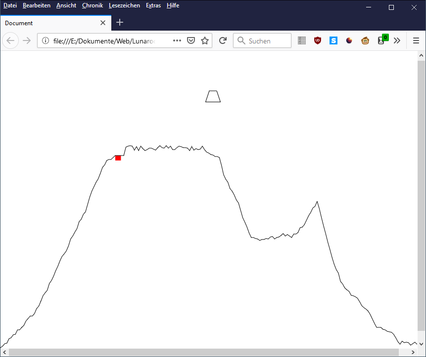

Lunarocket game in the style of the retro game Luna Lander. It gives the player the opportunity to experience navigation in a spaceship in a near zero gravity environment. Our game is developed in Javascript.
 
 
The visualisation and dynamic environment creation is developed by [@Codingsimon](https://github.com/Codingsimon)
 
The pyhsics simulation is developed by [@han-sei](https://github.com/han-sei)
 
 

